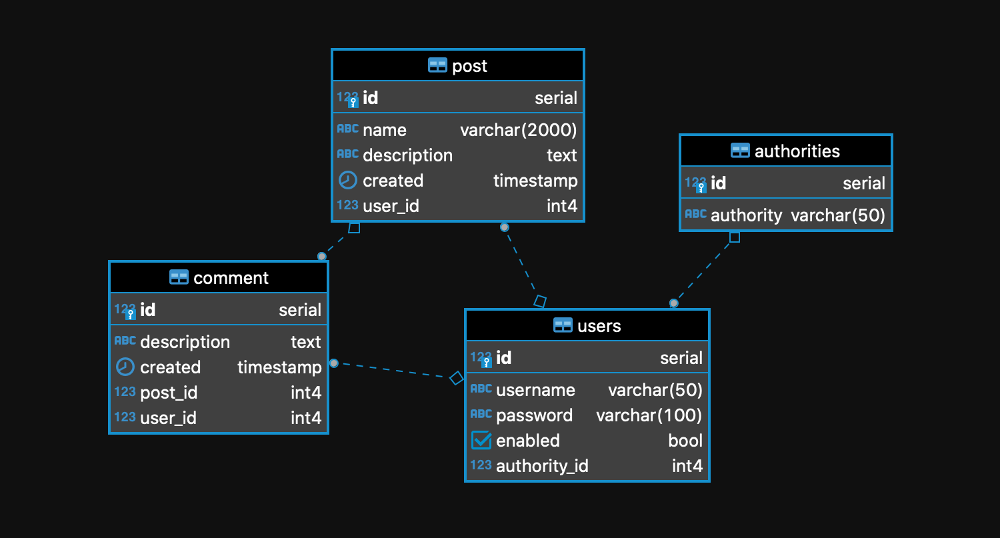
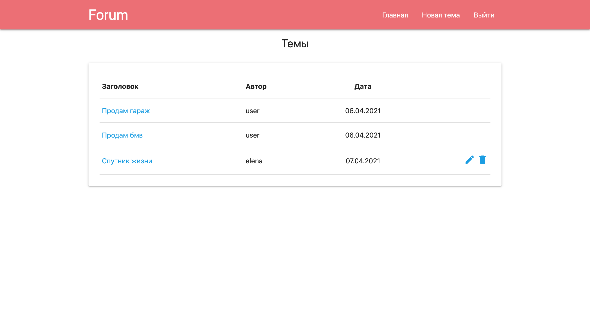
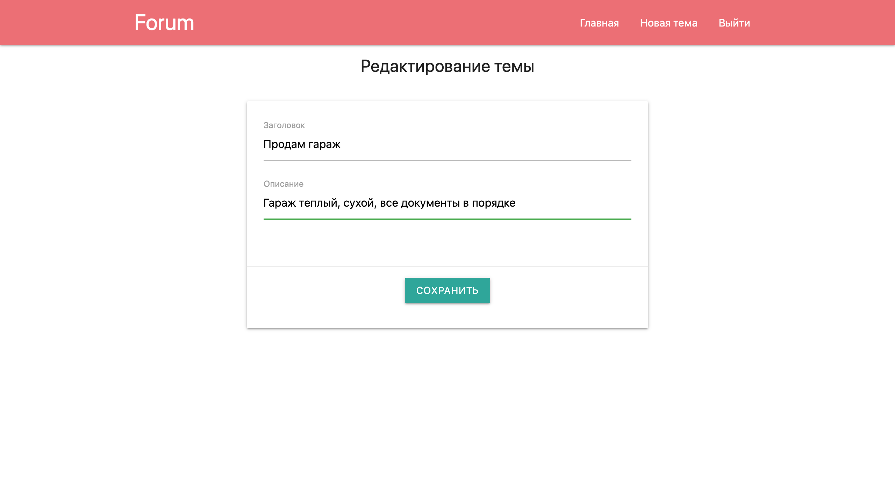
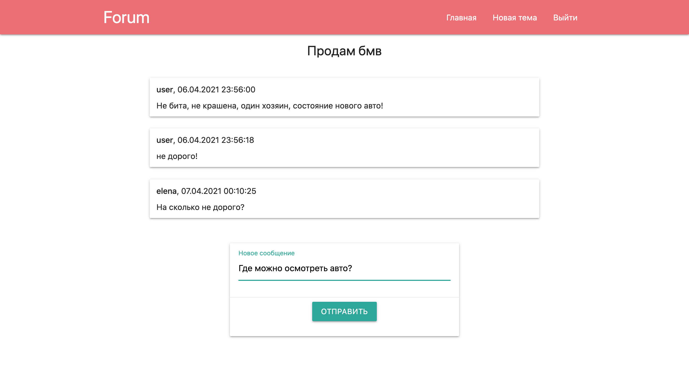
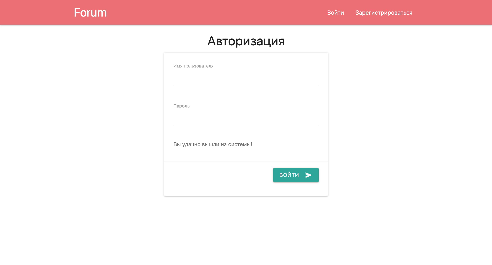

# Forum &nbsp;&nbsp;
 &nbsp;&nbsp;
 &nbsp;&nbsp;

<ul>
    <li>
        <a href="#about">О проекте</a>
        <ul>
            <li><a href="#description">Описание</a></li>
            <li><a href="#technologies">Технологии</a></li>
            <li><a href="#structure">Структура</a></li>
            <li><a href="#scheme">Схема БД</a></li>
        </ul>
    </li>
    <li>
        <a href="#intarface">Пользовательский интерфейс</a>
        <ul>
            <li><a href="#main_page">Главная страница</a></li>
            <li><a href="#new_post">Редактирование/создание темы</a></li>
            <li><a href="#view_post">Просмотр темы</a></li>
            <li><a href="#login_page">Регистрация/авторизация</a></li>
        </ul>
    </li>
    <li>
        <a href="#links">Полезные ссылки</a>
    </li>
    <li>
        <a href="#contact">Контакты</a>
    </li>
</ul>

<h2><a name="about">О проекте</a>&nbsp;&nbsp;<a href="#menu">&#9650;</a></h2>
<h4><a name="description">Описание</a>&nbsp;&nbsp;<a href="#menu">&#9650;</a></h4>

    Проект предназначен для знакомства со Spring Boot.

    Представляет собой простую реализацию форума. Каждый полльзователь может добавлять новые темы на форуме,
    редактировать их и оставлять комментарии в своих и чужих темах. Естественно не обошлось без авторизации/регистрации.

<h4><a name="technologies">Технологии</a>&nbsp;&nbsp;<a href="#menu">&#9650;</a></h4>
<ul>
    <li>Java 14</li>
    <li>Spring Boot(Data, Security, Test), JSP, JSTL</li>
    <li>PostgreSQL</li>
    <li>Maven, Heroku</li>
    <li><a href="https://materializecss.com">Material Design library</a></li>
</ul>

<h4><a name="structure">Структура</a>&nbsp;&nbsp;<a href="#menu">&#9650;</a></h4>
<pre><code>.
├─db
├───scripts
├─images
├─src
├───main
├─────java
├───────ru
├─────────reybos
├───────────forum
├─────────────config
├─────────────control
├─────────────model
├─────────────repository
├───────────────db
├───────────────mem
├─────────────service
├─────resources
├─────webapp
├───────WEB-INF
├─────────view
└───────────post
</code></pre>

<h4><a name="scheme">Схема БД</a>&nbsp;&nbsp;<a href="#menu">&#9650;</a></h4>

  

<h2><a name="build">Сборка</a>&nbsp;&nbsp;<a href="#menu">&#9650;</a></h2>
<ol>
    <li>
        Для успешной сборки и работы проекта на вашем компьютере должны быть установлены:
        <ol>
            <li>JDK 14(+)</li>
            <li>Maven</li>
            <li>PostgreSQL</li>
            <li>Tomcat</li>
        </ol>
    </li>
    <li>
        В PostgreSQL создайте базу с именем "forum"
    </li>
    <li>
        Скачайте проект к себе на компьютер с помощью команды 
        <code>git clone https://github.com/ReyBos/job4j_forum</code> 
        перейдите в корень проекта <code>cd job4j_forum</code>
    </li>
    <li>
        Добавьте настройки для доступа к базе данных, для этого внесите соответствующие изменения в файле 
        <code>src/main/resources/application.properties</code>
    </li>
    <li>
        Выполните запросы к базе данных из папки <code>db/scripts</code>
    </li>
    <li>
        Выполните команду <code>mvn install</code> в корне проекта для его сборки 
        В случае успешной сборки появится файл <code>target/forum-&#60;version&#62;.war</code> 
        переименуйте его в <code>forum.war</code>
    </li>
    <li>
        Для запуска веб-приложения вам нужно скопировать <code>forum.war</code> в папку <code>webapps</code> вашего Tomcat
    </li>
    <li>
        После запуска сервера приложение будет доступно по адресу 
        <a href="http://localhost:8080/forum/">http://localhost:8080/forum/</a>
    </li>
</ol>

<h2><a name="intarface">Пользовательский интерфейс</a>&nbsp;&nbsp;<a href="#menu">&#9650;</a></h2>

<h3><a name="main_page">Главная страница</a>&nbsp;&nbsp;<a href="#menu">&#9650;</a></h3>

    На главной странице выводится список всех доступных тем форума. На ней есть доступ к редактированию
    тем пользователя и ссылки на каждую из них.

  

<h3><a name="new_post">Редактирование/создание темы</a>&nbsp;&nbsp;<a href="#menu">&#9650;</a></h3>

    Редактирование и создание новой темы похожи, за той лишь разницей, что при редактировании загружаются 
    данные сохраненные в БД, с возможностью их изменить.

  

<h3><a name="view_post">Просмотр темы</a>&nbsp;&nbsp;<a href="#menu">&#9650;</a></h3>

    В каждой теме пользователям предоставлена возможность оставлять свои комментарии.

  

<h3><a name="login_page">Регистрация/авторизация</a>&nbsp;&nbsp;<a href="#menu">&#9650;</a></h3>

    Для того что бы пользователю был доступен функционал приложения, он должен быть зарегистрирован/авторизован. 

  

<h2><a name="links">Полезные ссылки</a>&nbsp;&nbsp;<a href="#menu">&#9650;</a></h2>

Ресурсы которые были полезны при создании проекта

<ul>
    <li>
        <strong><a href="https://coderoad.ru/22824190/%D0%9A%D0%B0%D0%BA-%D0%B8%D1%81%D0%BF%D0%BE%D0%BB%D1%8C%D0%B7%D0%BE%D0%B2%D0%B0%D1%82%D1%8C-%D1%84%D0%BE%D1%80%D0%BC%D0%B0%D1%82-%D0%B4%D0%B0%D1%82%D1%8B-%D0%BA%D0%B0%D0%BA-yyyy-MM-dd-%D1%81-JSTL">link</a></strong>
        - вывод форматированной даты jstl
    </li>
    <li>
        <strong><a href="https://www.baeldung.com/spring-redirect-and-forward">link</a></strong>
        - при редиректе на другую страницу передать параметры в гет запросе
    </li>
    <li>
        <strong><a href="https://sysout.ru/testirovanie-kontrollerov-s-pomoshhyu-mockmvc/">link</a></strong>
        - Тестирование контроллеров с помощью MockMvc
    </li>
    <!--<li>
        <strong><a href="">link</a></strong>
        - сервлеты и Ajax
    </li>-->
</ul>

<h2><a name="contact">Контакты</a>&nbsp;&nbsp;<a href="#menu">&#9650;</a></h2>

Связаться со мной по всем интересующим вопросам вы можете здесь:

&nbsp;&nbsp;
&nbsp;&nbsp;
&nbsp;&nbsp;
&nbsp;&nbsp;
&nbsp;&nbsp;
